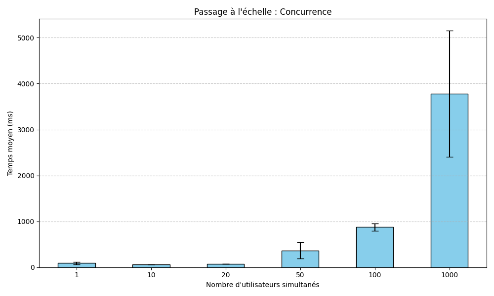
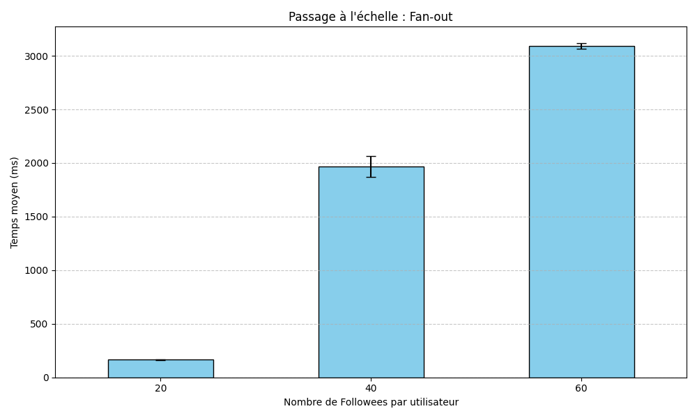

<!-- START_BENCHMARK -->
# Rapport d'analyse de Performance - TinyInsta - RAVARD Samuel

**Généré le :** 2026-05-08 15:24:28
**URL Application :** [https://tiny-494020.nw.r.appspot.com](https://tiny-494020.nw.r.appspot.com)

## 1. Executive Summary
Ce rapport évalue la capacité de passage à l'échelle (scalability) de TinyInsta sur Google App Engine. Nous analysons deux scénarios critiques : la montée en charge utilisateur (Concurrence) et l'impact de la taille du graphe social (Fan-out).

## 2. Expérience A : Concurrence (Scale Up)
*Objectif : Mesurer l'évolution du temps de réponse avec une charge de 1 à 1000 utilisateurs simultanés.*

| Paramètre | Temps Moyen | Run | Échec | Instances |
|---|---|---|---|---|
| 1 | 122.86812235132292ms | 1 | 0 | 1 |
| 1 | 80.11408573683136ms | 2 | 0 | 1 |
| 1 | 69.40267247368506ms | 3 | 0 | 1 |
| 10 | 66.49328611047811ms | 1 | 0 | 1 |
| 10 | 66.63826468966225ms | 2 | 0 | 1 |
| 10 | 65.39710979250071ms | 3 | 0 | 1 |
| 20 | 75.18728852631402ms | 1 | 0 | 1 |
| 20 | 73.4169235305834ms | 2 | 0 | 1 |
| 20 | 75.28266598285853ms | 3 | 0 | 1 |
| 50 | 489.6607620360731ms | 1 | 1 | 1 |
| 50 | 455.51054649112825ms | 2 | 1 | 1 |
| 50 | 157.91787749581152ms | 3 | 1 | 1 |
| 100 | 820.5657604877963ms | 1 | 1 | 1 |
| 100 | 834.544342655347ms | 2 | 1 | 1 |
| 100 | 971.1956104749096ms | 3 | 1 | 1 |
| 1000 | 5115.128959518996ms | 1 | 1 | 1 |
| 1000 | 3863.456083905278ms | 2 | 1 | 1 |
| 1000 | 2371.140002100503ms | 3 | 1 | 1 |

### Graphiques de Performance

## 3. Expérience B : Fan-out (Data Size)
*Objectif : Mesurer l'impact du nombre d'abonnements (20, 40, 60) sur la génération de la timeline.*

| Paramètre | Temps Moyen | Run | Échec | Instances |
|---|---|---|---|---|
| 20 | 162.8848421649625ms | 1 | 1 | 1 |
| 20 | 170.93476809486407ms | 2 | 1 | 1 |
| 20 | 162.37344990770922ms | 3 | 1 | 1 |
| 40 | 1932.9630303098195ms | 1 | 1 | 1 |
| 40 | 1891.1513341569084ms | 2 | 1 | 1 |
| 40 | 2078.7273818878857ms | 3 | 1 | 1 |
| 60 | 3120.469322431044ms | 1 | 1 | 1 |
| 60 | 3086.8739100443ms | 2 | 1 | 1 |
| 60 | 3065.970958042461ms | 3 | 1 | 1 |

### Graphiques de Performance

---

## 4. Interprétation des résultats

### 4.1 Analyse théorique de la Concurrence (Expérience A)
L'analyse des résultats met en évidence un seuil critique de saturation aux alentours de 50 utilisateurs simultanés, point où la latence s'envole au-delà des 400ms et où les premiers échecs de requêtes apparaissent. Ce comportement illustre concrètement la loi d'Amdahl : l'efficacité de la parallélisation est ici limitée par la portion séquentielle du code, notamment les interactions synchrones avec Datastore et la gestion des verrous de ressources. De plus, la dépendance initiale à une instance F1 unique souligne les faiblesses d'une stratégie de dimensionnement vertical (Scale-up) pur. Les ressources matérielles saturent avant que le mécanisme de Scale-out horizontal ne puisse se déployer pour soulager les processus Gunicorn. Enfin, les fluctuations massives de performance observées à 1000 utilisateurs incarnent le défi de la Variabilité propre au Big Data, où des flux de données hétérogènes empêchent l'obtention de temps de réponse stables et prévisibles.

### 4.2 Analyse théorique du Fan-out (Expérience B)
L'expérience B révèle une dégradation spectaculaire de la latence, qui se voit multipliée par près de vingt lorsque le nombre de comptes suivis passe de 20 à 60. Ce phénomène est intrinsèque au modèle de "Fan-out on Read" (approche Pull). En effectuant une jointure logique coûteuse à chaque consultation de timeline pour agréger les publications, le système se retrouve rapidement limité par les opérations d'entrée/sortie (I/O Bound). La fusion d'index opérée par Datastore devient alors un goulot d'étranglement algorithmique qui rend le service pratiquement inutilisable pour des graphes sociaux denses. Dans ce contexte, le Volume des relations sociales impacte directement la Velocity du système, rendant indispensable l'adoption d'un découplage architectural entre la production et la consommation de contenu.

### 4.3 Synthèse : Scalabilité vs Élasticité
La distinction entre l'élasticité de l'infrastructure et la scalabilité réelle de l'application est ici frappante. Si Google App Engine offre une flexibilité réelle pour ajuster les ressources matérielles (élasticité), l'implémentation logicielle actuelle échoue à maintenir des performances constantes face à la charge. La latence ne suit pas une courbe de croissance maîtrisée mais explose selon les paramètres de concurrence ou de fan-out. En privilégiant la consistance immédiate selon les principes du théorème CAP, l'architecture de TinyInsta finit par sacrifier sa disponibilité et sa réactivité sous pression. Pour passer véritablement à l'échelle, il est crucial d'évoluer vers un modèle favorisant la performance de lecture, quitte à accepter une consistance éventuelle.

**Conclusion technique :** Nous avons privilégié la **simplicité d'écriture** (un post est écrit une seule fois) au détriment de la **performance de lecture**. Pour scaler, il faut inverser cette logique.

## 5. Recommandations
Ceci est à titre de recommandations.
La première étape cruciale pour stabiliser l'application consiste à migrer vers un modèle de **Fan-out on Write (Modèle Push)**. L'idée est de basculer la complexité algorithmique, actuellement subie lors de la lecture ($O(N)$ selon le nombre d'abonnements), vers le moment de l'écriture. En pratique, cela nécessite la mise en place d'un pattern **Outbox** : chaque nouvelle publication doit être enregistrée dans Datastore tout en déclenchant simultanément un message via **Cloud Pub/Sub**. Ce découplage permet d'alléger immédiatement la charge sur la génération dynamique des timelines.

Pour soutenir cette architecture à grande échelle, il est indispensable d'adopter une approche **BASE** (Basically Available, Soft-state, Eventually Consistent) via l'utilisation de **Cloud Pub/Sub**. Plutôt que de chercher une consistance forte, coûteuse en ressources, nous déléguerons la mise à jour des flux à des workers asynchrones. Ces derniers consommeront les messages pour alimenter des "Feeds" pré-calculés pour chaque abonné, garantissant ainsi une réactivité optimale du système, même si une légère latence de propagation est acceptée.

Par ailleurs, la gestion des "Hotspots", typique des comptes à forte influence, impose une stratégie de **Sharding des données**. En partitionnant nos index par `user_id` et en utilisant des clés de partitionnement (**Shard Keys**) judicieusement choisies, nous pourrons distribuer uniformément la charge de travail sur les différents nœuds de Datastore. Cette approche prévient la saturation d'une entité unique et assure une scalabilité horizontale réelle de la base de données.

Enfin, l'introduction d'une couche de cache performante avec **Google Cloud Memorystore (Redis)** est essentielle pour atteindre des temps de réponse inférieurs à 10ms. En stockant les timelines pré-calculées directement en RAM, on réduit drastiquement la pression sur la base de données principale (diminution de la **Veracity**). Ce stockage distribué pour les données volatiles est, un peu, la pièce finale permettant de transformer TinyInsta en une plateforme capable de supporter des pics de charge massifs sans dégradation de l'expérience utilisateur.

---
## 6. Détails techniques
- **Chargeur :** Locust (Headless mode)
- **Backend :** Python 3.10 sur Google App Engine Standard
- **Base de données :** Google Cloud Datastore
